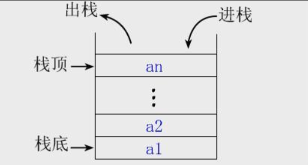
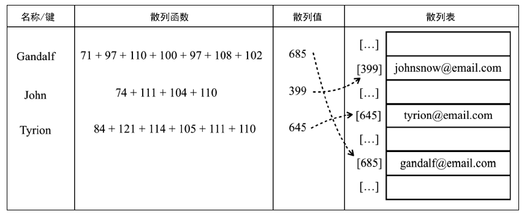
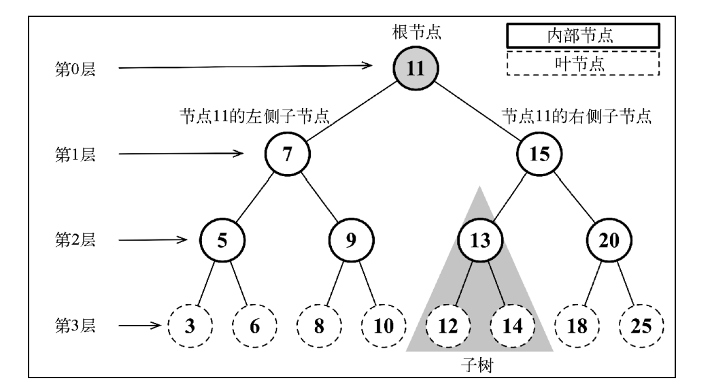
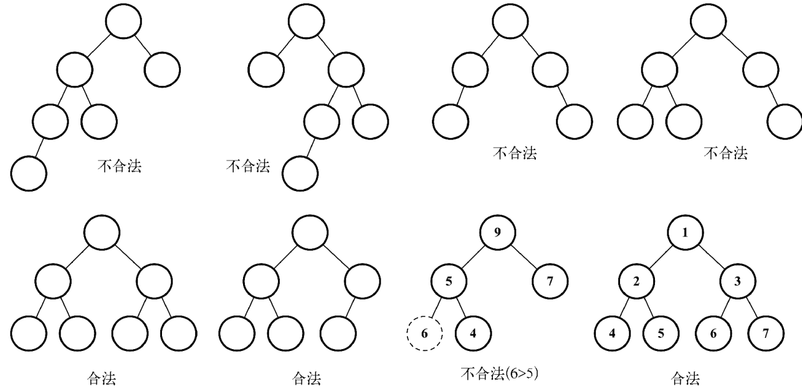
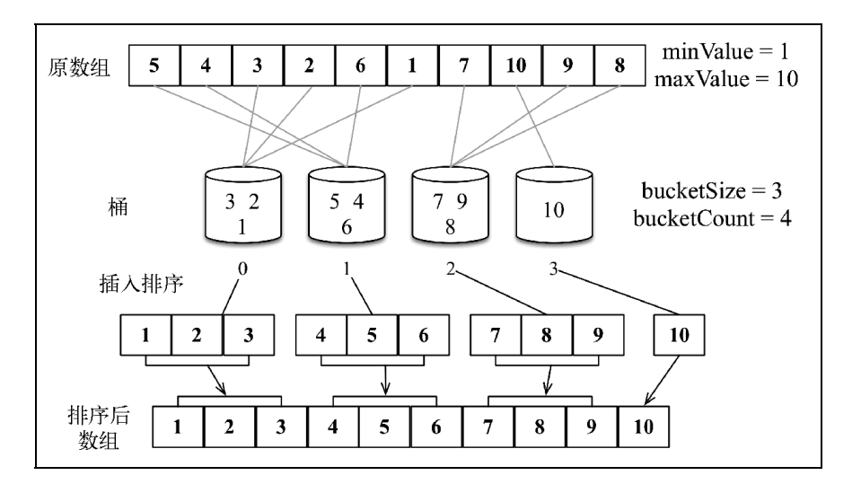
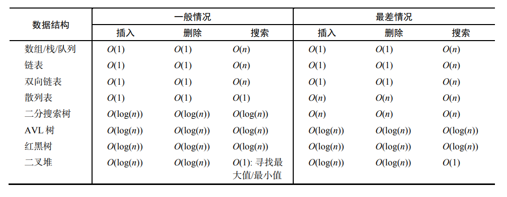
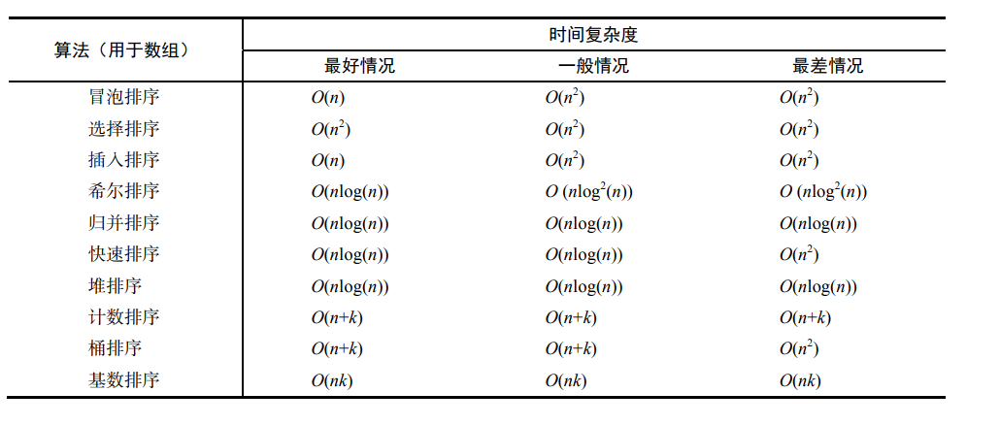

- [JS数据结构与算法](#js数据结构与算法)
  - [一. 初识数据结构与算法](#一-初识数据结构与算法)
    - [1. 常见的数据结构](#1-常见的数据结构)
    - [2. 算法](#2-算法)
  - [二. 数组结构](#二-数组结构)
      - [1 创建一个数组](#1-创建一个数组)
      - [2 数组的 length](#2-数组的-length)
      - [3 数组的索引](#3-数组的索引)
      - [4 数组的常用方法](#4-数组的常用方法)
  - [三. 栈结构](#三-栈结构)
    - [1.认识栈结构](#1认识栈结构)
    - [2. 封装栈结构](#2-封装栈结构)
    - [3. 应用](#3-应用)
      - [3-1 十进制转二进制](#3-1-十进制转二进制)
      - [3-2 进制转换法](#3-2-进制转换法)
  - [四. 队列](#四-队列)
    - [1.队列是什么？](#1队列是什么)
    - [2.队列的封装](#2队列的封装)
    - [3. 队列的应用-击鼓传花](#3-队列的应用-击鼓传花)
    - [4. 双端队列](#4-双端队列)
  - [五. 链表](#五-链表)
    - [1. 单链表](#1-单链表)
    - [2. 双向链表](#2-双向链表)
    - [3. 循环链表](#3-循环链表)
  - [六. 集合](#六-集合)
    - [1.集合类](#1集合类)
    - [2.ES6的Set](#2es6的set)
    - [3.集合的运算](#3集合的运算)
  - [七. 字典](#七-字典)
    - [1.字典的封装](#1字典的封装)
    - [2.散列表](#2散列表)
    - [3. ES6的Map](#3-es6的map)
  - [八 . 树](#八--树)
    - [1. 二叉树](#1-二叉树)
    - [2. 二叉搜索树](#2-二叉搜索树)
      - [2-1 遍历](#2-1-遍历)
      - [2-2 移除](#2-2-移除)
  - [九. 二叉堆](#九-二叉堆)
    - [1. 最小堆](#1-最小堆)
    - [2. 最大堆](#2-最大堆)
  - [十. 排序算法](#十-排序算法)
    - [1. 冒泡排序](#1-冒泡排序)
    - [2. 选择排序](#2-选择排序)
    - [3. 插入排序](#3-插入排序)
    - [4. 归并排序](#4-归并排序)
    - [5. 快速排序](#5-快速排序)
    - [6. 计数排序](#6-计数排序)
    - [7.  桶排序](#7--桶排序)
    - [8. 基数排序](#8-基数排序)
  - [十一. 搜索算法](#十一-搜索算法)
    - [1. 顺序搜索](#1-顺序搜索)
    - [2.二分搜索](#2二分搜索)
    - [3.内插搜索](#3内插搜索)
  - [十二. 随机算法](#十二-随机算法)
  - [十三.算法设计](#十三算法设计)
    - [1.分而治之](#1分而治之)
    - [2.动态规划](#2动态规划)
      - [2-1 背包问题](#2-1-背包问题)
      - [2-2 最长公共子序列](#2-2-最长公共子序列)
    - [3. 贪心算法](#3-贪心算法)
    - [4.回溯算法](#4回溯算法)
  - [十四. 算法复杂度](#十四-算法复杂度)


### JS数据结构与算法


#### 一. 初识数据结构与算法

> - “数据结构是数据对象，以及存在于该对象的实例和组成实例的数据元素之间的各种联系。这些联系可以通过定义相关的函数来给出。”——Sartaj Sahni，《数据结构、算法与应用》
> - “数据结构是ADT（抽象数据类型 Abstract DataType）的物理实现。”—— Clifford A.Shaffer，《数据结构与算法分析》
> - “数据结构（data structure）是计算机中存储、组织数据的方式。通常情况下，精心选择的数据结构可以带来最优效率的算法。”
>   ——中文维基百科


##### 1. 常见的数据结构

- 数组（Aarray）
- 栈（Stack）
- 链表（Linked List）
- 图（Graph）
- 散列表（Hash）
- 队列（Queue）
- 堆（Heap）
- 树（Tree）

##### 2. 算法

算法（Algorithm）是指解题方案的准确而完整的描述，是一系列解决问题的清晰指令，算法代表着用系统的方法描述解决问题的策略机制。也就是说，能够对一定规范的输入，在有限时间内获得所要求的输出。如果一个算法有缺陷，或不适合于某个问题，执行这个算法将不会解决这个问题。不同的算法可能用不同的时间，空间或效率来完成同样的任务。一个算法的优劣可以用空间复杂度与时间复杂度来衡量。


#### 二. 数组结构

- 什么是数组？

- 字面理解就是 **数字的组合**

- 其实不太准确，准确的来说数组是一个 **数据的集合**

- 也就是我们把一些数据放在一个盒子里面，按照顺序排好

  ```javascript
  [1, 2, 3, 'hello', true, false]
  ```

- 这个东西就是一个数组，存储着一些数据的集合


**数据类型分类**

- `number` / `string` / `boolean` / `undefined` / `null` / `object` / `function`  /  `array` / ...
- 数组也是数据类型中的一种
- 我们简单的把所有数据类型分为两个大类 **基本数据类型** 和 **复杂数据类型**

- 基本数据类型： `number` / `string` / `boolean` / `undefined` / `null` 
- 复杂数据类型： `object` / `function`  /  `array` / ...


###### 1 创建一个数组

- 数组就是一个 `[]`
- 在 `[]` 里面存储着各种各样的数据，按照顺序依次排好


**字面量创建一个数组**

- 直接使用 `[]` 的方式创建一个数组

  ```javascript
  // 创建一个空数组
  var arr1 = []
  
  // 创建一个有内容的数组
  var arr2 = [1, 2, 3]
  ```


**内置构造函数创建数组**

- 使用 `js` 的内置构造函数 `Array` 创建一个数组

  ```javascript
  // 创建一个空数组
  var arr1 = new Array()
  
  // 创建一个长度为 10 的数组
  var arr2 = new Array(10)
  
  // 创建一个有内容的数组
  var arr3 = new Array(1, 2, 3)
  ```

  

###### 2 数组的 length

- `length`:  长度的意思

- `length` 就是表示数组的长度，数组里面有多少个成员，`length` 就是多少

  ```javascript
  // 创建一个数组
  var arr = [1, 2, 3]
  
  console.log(arr.length) // 3
  ```


###### 3 数组的索引

- 索引，也叫做下标，是指一个数据在数组里面排在第几个的位置

- 注意： **在所有的语言里面，索引都是从 0 开始的**

- 在 `js` 里面也一样，数组的索引从 0 开始

  ```javascript
  // 创建一个数组
  var arr = ['hello', 'world']
  ```

- 上面这个数组中，**第 0 个** 数据就是字符串 `hello`，**第 1 个** 数据就是字符串 `world`

- 想获取数组中的第几个就使用 `数组[索引]` 来获取

  ```javascript
  var arr = ['hello', 'world']
  
  console.log(arr[0]) // hello
  console.log(arr[1]) // world
  ```

###### 4 数组的常用方法

- 数组是一个复杂数据类型，我们在操作它的时候就不能再想基本数据类型一样操作了

- 比如我们想改变一个数组

  ```javascript
  // 创建一个数组
  var arr = [1, 2, 3]
  
  // 我们想把数组变成只有 1 和 2
  arr = [1, 2]
  ```

  - 这样肯定是不合理，因为这样不是在改变之前的数组
  - 相当于心弄了一个数组给到 `arr` 这个变量了
  - 相当于把 `arr` 里面存储的地址给换了，也就是把存储空间换掉了，而不是在之前的空间里面修改
  - 所以我们就需要借助一些方法，在不改变存储空间的情况下，把存储空间里面的数据改变了


**数组常用方法之 push**

- `push` 是用来在数组的末尾追加一个元素

  ```javascript
  var arr = [1, 2, 3]
  
  // 使用 push 方法追加一个元素在末尾
  arr.push(4)
  
  console.log(arr) // [1, 2, 3, 4]
  ```


**数组常用方法之 pop**

- `pop` 是用来删除数组末尾的一个元素

  ```javascript
  var arr = [1, 2, 3]
  
  // 使用 pop 方法删除末尾的一个元素
  arr.pop()
  
  console.log(arr) // [1, 2]
  ```


**数组常用方法之 unshift**

- `unshift` 是在数组的最前面添加一个元素

  ```javascript
  var arr = [1, 2, 3]
  
  // 使用 unshift 方法想数组的最前面添加一个元素
  arr.unshift(4)
  
  console.log(arr) // [4, 1, 2, 3]
  ```


**数组常用方法之  shift**

- `shift` 是删除数组最前面的一个元素

  ```javascript
  var arr = [1, 2, 3]
  
  // 使用 shift 方法删除数组最前面的一个元素
  arr.shift()
  
  console.log(arr) // [2, 3]
  ```


**数组常用方法之 splice**

- `splice` 是截取数组中的某些内容，按照数组的索引来截取

- 语法： `splice(从哪一个索引位置开始，截取多少个，替换的新元素)` （第三个参数可以不写）

  ```javascript
  var arr = [1, 2, 3, 4, 5]
  
  // 使用 splice 方法截取数组
  arr.splice(1, 2)
  
  console.log(arr) // [1, 4, 5]
  ```

  - `arr.splice(1, 2)` 表示从索引 1 开始截取 2 个内容
  - 第三个参数没有写，就是没有新内容替换掉截取位置

  ```javascript
  var arr = [1, 2, 3, 4, 5]
  
  // 使用 splice 方法截取数组
  arr.splice(1, 2, '我是新内容')
  
  console.log(arr) // [1, '我是新内容', 4, 5]
  ```

  - `arr.splice(1, 2, '我是新内容')` 表示从索引 1 开始截取 2 个内容
  - 然后用第三个参数把截取完空出来的位置填充


**数组常用方法之 reverse**

- `reverse` 是用来反转数组使用的

  ```javascript
  var arr = [1, 2, 3]
  
  // 使用 reverse 方法来反转数组
  arr.reverse()
  
  console.log(arr) // [3, 2, 1]
  ```

**数组常用方法之 sort**

- `sort` 是用来给数组排序的

  ```javascript
  var arr = [2, 3, 1]
  
  // 使用 sort 方法给数组排序
  arr.sort()
  
  console.log(arr) // [1, 2, 3]
  ```

  - 这个只是一个基本的简单用法


**数组常用方法之 concat**

- `concat` 是把多个数组进行拼接

- 和之前的方法有一些不一样的地方，就是 `concat` 不会改变原始数组，而是返回一个新的数组

  ```javascript
  var arr = [1, 2, 3]
  
  // 使用 concat 方法拼接数组
  var newArr = arr.concat([4, 5, 6])
  
  console.log(arr) // [1, 2, 3]
  console.log(newArr) // [1, 2, 3, 4, 5, 6]
  ```

  - 注意： **`concat` 方法不会改变原始数组**


**数组常用方法之 join**

- `join` 是把数组里面的每一项内容链接起来，变成一个字符串

- 可以自己定义每一项之间链接的内容 `join(要以什么内容链接)`

- 不会改变原始数组，而是把链接好的字符串返回

  ```javascript
  var arr = [1, 2, 3]
  
  // 使用 join 链接数组
  var str = arr.join('-')
  
  console.log(arr) // [1, 2, 3]
  console.log(str) // 1-2-3
  ```

  - 注意： **join 方法不会改变原始数组，而是返回链接好的字符串**

**数组常用方法之 indexOf**

- `indexOf` 用来找到数组中某一项的索引

- 语法： `indexOf(你要找的数组中的项)`

  ```javascript
  var arr = [1, 2, 3, 4, 5]
  
  // 使用 indexOf 超找数组中的某一项
  var index = arr.indexOf(3)
  
  console.log(index) // 2
  ```

  - 我们要找的是数组中值为 3 的那一项
  - 返回的就是值为 3 的那一项在该数组中的索引

- 如果你要找的内容在数组中没有，那么就会返回 -1

  ```javascript
  var arr = [1, 2, 3, 4, 5]
  
  // 使用 indexOf 超找数组中的某一项
  var index = arr.indexOf(10)
  
  console.log(index) // -1
  ```

  - 你要找的值在数组中不存在，那么就会返回 -1


**数组常用方法之 forEach**

- 和 `for` 循环一个作用，就是用来遍历数组的

- 语法：`arr.forEach(function (item, index, arr) {})`

  ```javascript
  var arr = [1, 2, 3]
  
  // 使用 forEach 遍历数组
  arr.forEach(function (item, index, arr) {
    // item 就是数组中的每一项
    // index 就是数组的索引
    // arr 就是原始数组
    console.log('数组的第 ' + index + ' 项的值是 ' + item + '，原始数组是', arr)
  })
  ```

  - `forEach()` 的时候传递的那个函数，会根据数组的长度执行
  - 数组的长度是多少，这个函数就会执行多少回


**数组常用方法之 map** 

- 和 `forEach` 类似，只不过可以对数组中的每一项进行操作，返回一个新的数组

  ```javascript
  var arr = [1, 2, 3]
  
  // 使用 map 遍历数组
  var newArr = arr.map(function (item, index, arr) {
    // item 就是数组中的每一项
    // index 就是数组的索引
    // arr 就是原始数组
    return item + 10
  })
  
  console.log(newArr) // [11, 12, 13]
  ```


**数组常用方法之 filter**

- 和 `map` 的使用方式类似，按照我们的条件来筛选数组

- 把原始数组中满足条件的筛选出来，组成一个新的数组返回

  ```javascript
  var arr = [1, 2, 3]
  
  // 使用 filter 过滤数组
  var newArr = arr.filter(function (item, index, arr) {
    // item 就是数组中的每一项
    // index 就是数组的索引
    // arr 就是原始数组
    return item > 1
  })
  
  console.log(newArr) // [2, 3]
  ```

  - 我们设置的条件就是 `> 1`
  - 返回的新数组就会是原始数组中所有 `> 1` 的项


#### 三. 栈结构

##### 1.认识栈结构

> 栈（stack）又名堆栈，它是一种运算受限的线性表。限定仅在表尾进行插入和删除操作的线性表。这一端被称为栈顶，相对地，把另一端称为栈底。向一个栈插入新元素又称作进栈、入栈或压栈，它是把新元素放到栈顶元素的上面，使之成为新的栈顶元素；从一个栈删除元素又称作出栈或退栈，它是把栈顶元素删除掉，使其相邻的元素成为新的栈顶元素。

**特点：后进先出即Last in First Out（LIFO）。**


**函数调用栈**




##### 2. 封装栈结构

```js
class Stack{
    #items = []

    push(data){
        this.#items.push(data)
    }

    pop(){
        return this.#items.pop()
    }

    peek(){
        //    return this.items[this.items.length-1]
        return this.#items.at(-1)
    }
    isEmpty(){
        return this.#items.length===0
    }

    size(){
        return this.#items.length
    }

    clear(){
        this.#items = []
    }

    toString(){
        return this.#items.join("")
    }
}
```

##### 3. 应用

###### 3-1 十进制转二进制

```js
function convert(decNumber){
    let remStack = new Stack()
    let number = decNumber
    let rem 
    let string = ""

    while(number>0){
        rem = number%2
        remStack.push(rem)
        number = Math.floor(number/2)
    }

    while(!remStack.isEmpty()){
        string+=remStack.pop()
    }

    return string
}
```

###### 3-2 进制转换法

```js
function convert(decNumber,base){
    let remStack = new Stack()
    let number = decNumber
    let rem 
    let string = ""
    let baseStr = "0123456789ABCDEF"
    while(number>0){
        rem = number%base
        remStack.push(rem)
        number = Math.floor(number/base)
    }

    while(!remStack.isEmpty()){
        string+= baseStr[remStack.pop()]
    }

    return string
}
```


#### 四. 队列

##### 1.队列是什么？

> 队列是一种特殊的线性表，特殊之处在于它只允许在表的前端（front）进行删除操作，而在表的后端（rear）进行插入操作，和栈一样，队列是一种操作受限制的线性表。进行插入操作的端称为队尾，进行删除操作的端称为队头。队列中没有元素时，称为空队列。

队列的数据元素又称为队列元素。在队列中插入一个队列元素称为入队，从队列中删除一个队列元素称为出队。因为队列只允许在一端插入，在另一端删除，所以只有最早进入队列的元素才能最先从队列中删除，故队列又称为先进先出（FIFO—first in first out）线性表。 


##### 2.队列的封装


```js
class Queue {
    #items = {}
    #count = 0
    #lowCount = 0

    dequeue() {
        if(this.isEmpty()){
            return undefined
        }
        let res = this.#items[this.#lowCount]
        delete this.#items[this.#lowCount]
        this.#lowCount++
        return res
    }

    enqueue(data) {
        this.#items[this.#count] = data
        this.#count++
    }

    front() {
        return this.#items[this.#lowCount]
    }

    isEmpty() {
        return this.size() === 0
    }

    size() {
        return this.#count-this.#lowCount
    }

    clear() {
        this.#items = {}
        this.#count = 0;
        this.#lowCount = 0
    }

    toString() {
        let str = ""
        for(let i =this.#lowCount;i<this.#count;i++){
            str += `${this.#items[i]} `
            }
        return str
    }
}
```


##### 3. 队列的应用-击鼓传花

```js
function game(list,num){
    let queue = new Queue()
    for(let i=0;i<list.length;i++){
        queue.enqueue(list[i])
    }

    while(queue.size()>1){
        for(let i=0;i<num;i++){
            queue.enqueue(queue.dequeue())
        }
        console.log(queue.dequeue(),"淘汰了")
    }

    return {
        winner:queue.dequeue()
    }
}

game(["kerwin","tiechui","xiaoming","gangdaner","guludunzi"],7)
```


##### 4. 双端队列

```js
class DeQueue {
    #items = {}
    #lowCount = 0
    #count = 0
    removeFront() {
        if (this.isEmpty()) {
            return undefined
        }
        let res = this.#items[this.#lowCount]
        delete this.#items[this.#lowCount]
        this.#lowCount++
        return res
    }

    addBack(data) {
        this.#items[this.#count] = data
        this.#count++
    }

    addFront(data) {
        if(this.isEmpty()){
            this.addBack(data)
        }else if(this.#lowCount>0){
                 this.#lowCount--;
                 this.#items[this.#lowCount] = data
                 }else{
            for(let i = this.#count;i>0;i--){
                this.#items[i] = this.#items[i-1]
                }
            this.#count++;
            this.#lowCount = 0;
            this.#items[0] = data
        }
    }

    removeBack() {
        if (this.isEmpty()) {
            return undefined
        }

        this.#count--;
        const result = this.#items[this.#count]
        delete this.#items[this.#count]

        return result
    }

    peekFront() {
        return this.#items[this.#lowCount]
    }
    peekBack() {
        if (this.isEmpty()) {
            return undefined
        }
        return this.#items[this.#count - 1]
    }

    isEmpty() {
        return this.size() === 0
    }

    size() {
        return this.#count - this.#lowCount
    }

    clear() {
        this.#items = {}
        this.#count = 0
        this.#lowCount = 0
    }

    toString() {
        let str = ""
        for (let i = this.#lowCount; i < this.#count; i++) {
             str += `${this.#items[i]} `
             }
        return str
    }
}
```


#### 五. 链表

> 链表是一种物理存储单元上非连续、非顺序的存储结构，数据元素的逻辑顺序是通过链表中的指针链接次序实现的。链表由一系列结点（链表中每一个元素称为结点）组成，结点可以在运行时动态生成。每个结点包括两个部分：一个是存储数据元素的数据域，另一个是存储下一个结点地址的指针域。
>
> 使用链表结构可以克服数组链表需要预先知道数据大小的缺点，链表结构可以充分利用计算机内存空间，实现灵活的内存动态管理。但是链表失去了数组随机读取的优点，同时链表由于增加了结点的指针域，空间开销比较大。


**链表的特点**

1.插入、删除数据效率高O(1)级别（只需更改指针指向即可），随机访问效率低O(n)级别（需要从链头至链尾进行遍历）。
2.和数组相比，内存空间消耗更大，因为每个存储数据的节点都需要额外的空间存储后继指针。

##### 1. 单链表

> 每个节点只包含一个指针，即后继指针。


```js
class Node {
    constructor(element){
        this.element = element
        this.next = null
    }
}

class LinkedList {
    constructor(){
        this.head = null
        this.count = 0
    }

    push(element){
        const node = new Node(element)
        let current ;
        if(this.head===null){
            this.head = node
        }else{
            current = this.head

            while(current.next!==null){
                current = current.next
            }

            current.next = node
        }
        this.count++
    }


    removeAt(index){
        if(index>=0&&index<this.count){
            let current = this.head
            if(index===0){
                this.head = current.next
            }else{
                let previous 
                for(let i =0;i<index;i++){
                    previous = current
                    current = current.next
                }

                previous.next = current.next
            }

            this.count--
            return current.element
        }

        return 
    }

    getNodeAt(index){
        if(index>=0&&index<this.count){
            let node = this.head

            for(let i=0;i<index;i++){
                node= node.next
            }
            return node
        }
        return 
    }

    removeAt2(index){
        if(index>=0&&index<this.count){
            let current = this.head
            if(index===0){
                this.head = current.next
            }else{
                const previous = this.getNodeAt(index-1)

                current = previous.next

                previous.next = current.next
            }

            this.count--
            return current.element
        }

        return 
    }

    equalFn(a,b){
        return JSON.stringify(a)===JSON.stringify(b)
    }

    indexOf(element){
        let current = this.head

        for(let i=0;i<this.count;i++){
            if(this.equalFn(element,current.element)){
                return i
            }
            current = current.next
        }

        return -1
    }


    remove(element){
        const index = this.indexOf(element)
        return this.removeAt(index)
    }


    insert(element,index){
        if(index>=0&& index<=this.count){
            const node = new Node(element)

            if(index===0){

                const current = this.head
                node.next = current
                this.head = node
            }else{
                const previous = this.getNodeAt(index-1)
                const current = previous.next

                node.next =  current

                previous.next = node
            }

            this.count++
            return true
        }
        return false
    }

    isEmpty(){
        return this.size()===0
    }
    size(){
        return this.count
    }

    getHead(){
        return this.head
    }
}

```


##### 2. 双向链表

> 节点除了存储数据外，还有两个指针分别指向前一个节点地址（前驱指针prev）和下一个节点地址（后继指针next）。


```js
class DoublyNode extends Node { 
    constructor(element) {
        super(element); 
        this.prev = null; 
    }
}

class DoublyLinkedList extends LinkedList {
    constructor() {
        super();
        this.tail = null;
    }

    push(element) {
        const node = new DoublyNode(element);
        if (this.head == null) {
            this.head = node;
            this.tail = node; 
        } else {
            this.tail.next = node;
            node.prev = this.tail;
            this.tail = node;
        }
        this.count++;
    }

    insert(element, index) {
        if (index >= 0 && index <= this.count) {
            const node = new DoublyNode(element);
            let current = this.head;
            if (index === 0) {
                if (this.head == null) { 
                    this.head = node;
                    this.tail = node; 
                } else {
                    node.next = this.head;
                    this.head.prev = node; 
                    this.head = node;
                }
            } else if (index === this.count) { 
                current = this.tail;
                current.next = node;
                node.prev = current;
                this.tail = node;
            } else {
                const previous = this.getNodeAt(index - 1);
                current = previous.next;
                node.next = current;
                previous.next = node;
                current.prev = node; 
                node.prev = previous; 
            }
            this.count++;
            return true;
        }
        return false;
    }

    removeAt(index) {
        if (index >= 0 && index < this.count) {
            let current = this.head;
            if (index === 0) {
                this.head = this.head.next;

                if (this.count === 1) {
                    // {2}
                    this.tail = undefined;
                } else {
                    this.head.prev = undefined;
                }
            } else if (index === this.count - 1) {
                current = this.tail;
                this.tail = current.prev;
                this.tail.next = undefined;
            } else {
                current = this.getNodeAt(index);
                const previous = current.prev;
                previous.next = current.next;
                current.next.prev = previous; // NEW
            }
            this.count--;
            return current.element;
        }
        return undefined;
    }


    getHead() {
        return this.head;
    }

    getTail() {
        return this.tail;
    }
}

```

##### 3. 循环链表

> 循环链表和链表之间唯一的区别在于，最后一个元素指向下一个元素的指针（tail.next）不是引用 undefined，而是指向第一个元素（head）


```js
 class CircularLinkedList extends LinkedList {
     constructor() {
         super();
     }

     push(element) {
         const node = new Node(element);
         let current;
         if (this.head == null) {
             this.head = node;
         } else {
             current = this.getNodeAt(this.size() - 1);
             current.next = node;
         }
         node.next = this.head;
         this.count++;
     }

     insert(element, index) {
         if (index >= 0 && index <= this.count) {
             const node = new Node(element);
             let current = this.head;
             if (index === 0) {
                 if (this.head == null) {
                     // if no node  in list
                     this.head = node;
                     node.next = this.head;
                 } else {
                     node.next = current;
                     current = this.getNodeAt(this.size() - 1);
                     // update last element
                     this.head = node;
                     current.next = this.head;
                 }
             } else {
                 const previous = this.getNodeAt(index - 1);
                 node.next = previous.next;
                 previous.next = node;
             }
             this.count++;
             return true;
         }
         return false;
     }

     removeAt(index) {
         if (index >= 0 && index < this.count) {
             let current = this.head;
             if (index === 0) {
                 if (this.size() === 1) {
                     this.head = undefined;
                 } else {
                     let last  = this.getNodeAt(this.size() - 1);
                     this.head = this.head.next;
                     last.next = this.head;
                 }
             } else {
                 const previous = this.getNodeAt(index - 1);
                 current = previous.next;
                 previous.next = current.next;// 如果删的是最后一个也不怕，current.next 是head
             }
             this.count--;
             return current.element;
         }
         return undefined;
     }
 }
```

#### 六. 集合

> 集合是由一组无序且唯一（即不能重复）的项组成的。


##### 1.集合类

```js
class KerwinSet {
    constructor() {
        this.items = {};
    }
    add(element) {
        if (!this.has(element)) {
            this.items[element] = element; 
            return true;
        }
        return false;
    }

    delete(element) {
        if (this.has(element)) {
            delete this.items[element]; 
            return true;
        }
        return false;
    }

    clear() {
        this.items = {};
    }

    size() {
        return Object.keys(this.items).length; 
    }

    values() {
        return Object.values(this.items);
    }

    has(element) {
        return element in this.items;
    }
}
```


##### 2.ES6的Set

```js
var myset = new Set()

myset.add(100)
myset.add(200)
myset.size
myset.values()
myset.delete(100)
myset.clear()
```


##### 3.集合的运算

- 并集：对于给定的两个集合，返回一个包含两个集合中所有元素的新集合。

- 交集：对于给定的两个集合，返回一个包含两个集合中共有元素的新集合。 

- 差集：对于给定的两个集合，返回一个包含所有存在于第一个集合且不存在于第二个集 合的元素的新集合。

  


#### 七. 字典

> 字典和集合很相似，集合以[值，值]的形式存储元素，字 典则是以[键，值]的形式来存储元素。字典也称作映射、符号表或关联数组。


##### 1.字典的封装

```js
class Dictionary {
    constructor() {
        this.table = {};
    }
    toStrFn(item) {
        if (item === null) {
            return 'NULL';
        } else if (item === undefined) {
            return 'UNDEFINED';
        } else if (typeof item === 'string' || item instanceof String) {
            return `${item}`;
        }
        return JSON.stringify(item);
    }
    hasKey(key) {
        return this.table[this.toStrFn(key)] != null;
    }
    set(key, value) {
        if (key != null && value != null) {
            const tableKey = this.toStrFn(key);
            this.table[tableKey] = new ValuePair(key, value);
            return true;
        }
        return false;
    }

    remove(key) {
        if (this.hasKey(key)) {
            delete this.table[this.toStrFn(key)];
            return true;
        }
        return false;
    }

    get(key) {
        const valuePair = this.table[this.toStrFn(key)];
        return valuePair == null ? undefined : valuePair.value;
    }
    //它会以数组形式返回字典中的所有 valuePair 对象。
    keyValues() {
        return Object.values(this.table);
    }

    keys() {
        return this.keyValues().map(valuePair => valuePair.key);
    }

    values() {
        return this.keyValues().map(valuePair => valuePair.value);
    }

    size() {
        return Object.keys(this.table).length;
    }
    isEmpty() {
        return this.size() === 0;
    }

    clear() {
        this.table = {};
    }

    forEach(callbackFn) {
        const valuePairs = this.keyValues(); 
        for (let i = 0; i < valuePairs.length; i++) { 
            callbackFn(valuePairs[i].key, valuePairs[i].value); 
        }
    }
}

class ValuePair {
    constructor(key, value) {
        this.key = key;
        this.value = value;
    }
}

var mymap = new Dictionary()
```


##### 2.散列表

> HashMap 类，它是 Dictionary 类的一种散列表 实现方式。.散列算法的作用是尽可能快地在数据结构中找到一个值。



```js
class ValuePair {
    constructor(key, value) {
        this.key = key;
        this.value = value;
    }
}

class HashTable {
    constructor() {
        this.table = {};
    }
    toStrFn(item) {
        if (item === null) {
            return 'NULL';
        } else if (item === undefined) {
            return 'UNDEFINED';
        } else if (typeof item === 'string' || item instanceof String) {
            return `${item}`;
        }
        return JSON.stringify(item);
    }
    myHashCode1(key) {
        if (typeof key === 'number') {
            return key;
        }
        const tableKey = this.toStrFn(key);
        let hash = 0; 
        for (let i = 0; i < tableKey.length; i++) {
            hash += tableKey.charCodeAt(i);
        }

        //为了得到比较小的数值，我们会使用 hash 值和一个任意数做除法的余数
        return hash % 37; 
    }
    myHashCode2(key) {
        const tableKey = this.toStrFn(key); 
        let hash = 5381; 
        for (let i = 0; i < tableKey.length; i++) { 
            hash = (hash * 33) + tableKey.charCodeAt(i); 
        }
        return hash % 1013;
    }
    hashCode(key) {
        return this.myHashCode2(key);
    }

    put(key, value) {
        if (key != null && value != null) {
            const position = this.hashCode(key); 
            this.table[position] = new ValuePair(key, value);
            return true;
        }
        return false;
    }

    get(key) {
        const valuePair = this.table[this.hashCode(key)];
        return valuePair == null ? undefined : valuePair.value;
    }

    remove(key) {
        const hash = this.hashCode(key); 
        const valuePair = this.table[hash]; 
        if (valuePair != null) {
            delete this.table[hash]; 
            return true;
        }
        return false;
    }
}
```


##### 3. ES6的Map

```js
var mymap = new Map()
mymap.set("name","kerwin")
mymap.set({a:1},"aaaaaa")

mymap.get("name")
mymap.delete("name")
```


#### 八 . 树

> 树是一种分层数据的抽象模型。



##### 1. 二叉树

> 二叉树中的节点最多只能有两个子节点：一个是左侧子节点，另一个是右侧子节点。


##### 2. 二叉搜索树

> 二叉搜索树（BST）是二叉树的一种，但是只允许你在左侧节点存储（比父节点）小的值， 在右侧节点存储（比父节点）大的值。

```js
const Compare = {
    LESS_THAN: -1,
    BIGGER_THAN: 1,
    EQUALS: 0
};
class Node {
    constructor(key) {
        this.key = key; // 节点值
        this.left = null; // 左侧子节点引用
        this.right = null; // 右侧子节点引用
    }
}

class BinarySearchTree {
    constructor() {
        this.root = null; //Node 类型的根节点
    }
    insert(key) {
        if (this.root == null) {
            this.root = new Node(key);
        } else {
            this.insertNode(this.root, key);
        }
    }
    insertNode(node, key) {
        if (this.compareFn(key, node.key) === Compare.LESS_THAN) {
            if (node.left == null) {
                node.left = new Node(key);
            } else {
                this.insertNode(node.left, key);
            }
        } else {
            if (node.right == null) {
                node.right = new Node(key);
            } else {
                this.insertNode(node.right, key);
            }
        }
    }

    compareFn(a, b) {
        if (a === b) {
            return Compare.EQUALS;
        }
        return a < b ? Compare.LESS_THAN : Compare.BIGGER_THAN;
    }

    inOrderMap(callback) {
        this.inOrderMapNode(this.root, callback); 
    }

    inOrderMapNode(node, callback) {
        if (node != null) { 
            this.inOrderMapNode(node.left, callback); 
            callback(node.key); 
            this.inOrderMapNode(node.right, callback); 
        }
    }

    preOrderMap(callback) {
        this.preOrderMapNode(this.root, callback);
    }

    preOrderMapNode(node, callback) {
        if (node != null) {
            callback(node.key);
            this.preOrderMapNode(node.left, callback);
            this.preOrderMapNode(node.right, callback);
        }
    }

    postOrderMap(callback) {
        this.postOrderMapNode(this.root, callback);
    }

    postOrderMapNode(node, callback) {
        if (node != null) {
            this.postOrderMapNode(node.left, callback);
            this.postOrderMapNode(node.right, callback);
            callback(node.key);
        }
    }

    min() {
        return this.minNode(this.root);
    }
    minNode(node) {
        let current = node;
        while (current != null && current.left != null) {
            current = current.left;
        }
        return current;
    }
    max() {
        return this.maxNode(this.root);
    }
    maxNode(node) {
        let current = node;
        while (current != null && current.right != null) {
            current = current.right;
        }
        return current;
    }

    search(key) {
        return this.searchNode(this.root, key);
    }
    searchNode(node, key) {
        if (node == null) {
            return false;
        }
        if (this.compareFn(key, node.key) === Compare.LESS_THAN) {
            return this.searchNode(node.left, key);
        } else if (
            this.compareFn(key, node.key) === Compare.BIGGER_THAN
        ) {
            return this.searchNode(node.right, key);
        } else {
            return true;
        }
    }

    remove(key) {
        this.root = this.removeNode(this.root, key); 
    }
    removeNode(node, key) {
        if (node == null) { 
            return null;
        }
        if (this.compareFn(key, node.key) === Compare.LESS_THAN) { 
            node.left = this.removeNode(node.left, key); 
            return node; 
        } else if (
            this.compareFn(key, node.key) === Compare.BIGGER_THAN
        ) {
            node.right = this.removeNode(node.right, key); 
            return node; 
        } else {
            // 键等于 node.key
            // 第一种情况
            if (node.left == null && node.right == null) { 
                node = null; 
                return node; 
            }
            // 第二种情况  不用担心其中一个节点会比上个节点大
            if (node.left == null) { 
                node = node.right; 
                return node; 
            } else if (node.right == null) { 
                node = node.left; 
                return node; 
            } 
            // 第三种情况
            const target = this.minNode(node.right); 
            node.key = target.key; 
            node.right = this.removeNode(node.right, target.key); 
            return node;
        }
    }
}
```


###### 2-1 遍历

- 中序遍历是一种以上行顺序访问 BST 所有节点的遍历方式，也就是以从最小到最大的顺序
  访问所有节点。 中序遍历的一种应用就是对树进行排序操作。
- 先序遍历是以优先于后代节点的顺序访问每个节点的。先序遍历的一种应用是打印一个结构
  化的文档。
- 后序遍历则是先访问节点的后代节点，再访问节点本身。后序遍历的一种应用是计算一个目
  录及其子目录中所有文件所占空间的大小。


###### 2-2 移除


#### 九. 二叉堆

二叉堆是一种特殊的二叉树，有以下两个特性。 

- 它是一棵完全二叉树，表示树的每一层都有左侧和右侧子节点（除了最后一层的叶节点）， 并且最后一层的叶节点尽可能都是左侧子节点，这叫作结构特性。 
- 二叉堆不是最小堆就是最大堆。最小堆允许你快速导出树的最小值，最大堆允许你快速 导出树的最大值。所有的节点都大于等于（最大堆）或小于等于（最小堆）每个它的子 节点。这叫作堆特性。



##### 1. 最小堆

```js
const Compare = {
    less: -1,
    bigger: 1,
    equ: 0
}
class MinHeap {
    heap = [];

getLeftIndex(index) {
    return 2 * index + 1;
}
getRightIndex(index) {
    return 2 * index + 2;
}
getParentIndex(index) {
    if (index === 0) {
        return undefined;
    }
    return Math.floor((index - 1) / 2);
}

insert(value) {
    if (value != null) {
        this.heap.push(value); // {1}
        this.siftUp(this.heap.length - 1); // {2}
        return true;
    }
    return false;
}
compareFn(a, b) {
    if (a === b) {
        return Compare.equ
    }
    return a < b ? Compare.less : Compare.bigger
}

siftUp(index) {
    let parent = this.getParentIndex(index);
    while (
        index > 0 &&
        this.compareFn(this.heap[parent], this.heap[index]) ===
        Compare.bigger
    ) {
        swap(this.heap, parent, index);
        index = parent;
        parent = this.getParentIndex(index);
    }
}

size() {
    return this.heap.length;
}

isEmpty() {
    return this.size() === 0;
}
findMinimum() {
    return this.heap[0];
}

extract() {
    if (this.isEmpty()) {
        return undefined;
    }
    if (this.size() === 1) {
        return this.heap.shift();
    }
    const removedValue = this.heap[0];
    this.heap[0] = this.heap.pop(); //不破坏结构
    this.siftDown(0);
    return removedValue;
}
siftDown(index) {
    let element = index; 
    const left = this.getLeftIndex(index); 
    const right = this.getRightIndex(index); 
    const size = this.size();
    if (
        left < size &&
        this.compareFn(this.heap[element], this.heap[left]) ===
        Compare.bigger
    ) {
        element = left;
        //如果大， element 改变了
    }
    if (
        //上面最新的element 与 右边进行对比
        right < size &&
        this.compareFn(this.heap[element], this.heap[right]) ===
        Compare.bigger
    ) {
        element = right;
    }
    if (index !== element) {
        swap(this.heap, index, element);
        this.siftDown(element);
    }
}

}

function swap(array, a, b) {
    const temp = array[a];
    array[a] = array[b];
    array[b] = temp;
}

var heap = new MinHeap()
```

##### 2. 最大堆

```js
class MaxHeap extends MinHeap {
    constructor() {
        super();
    }

    compareFn(a, b) {
        if (a === b) {
            return Compare.equ
        }
        return a > b ? Compare.less : Compare.bigger
    }
}

```


#### 十. 排序算法

##### 1. 冒泡排序

> 冒泡排序比较所有相邻的两个项，如果第一个比第二个大，则交换它们。元素项向上移动至 正确的顺序，就好像气泡升至表面一样，冒泡排序因此得名。

```js
function bubbleSort(array) {
    const {
        length
    } = array;
    for (let i = 0; i < length; i++) {
        for (let j = 0; j < length - 1; j++) {
            if (array[j] > array[j + 1]) {
                swap(array, j, j + 1);
            }
        }
    }
    return array;
}

function swap(array, a, b) {
    const temp = array[a];
    array[a] = array[b];
    array[b] = temp;
}
```


##### 2. 选择排序

> 选择排序算法是一种原址比较排序算法。选择排序大致的思路是找到数据结构中的最小值并 将其放置在第一位，接着找到第二小的值并将其放在第二位，以此类推。

```js
function selectionSort(array) {
    const {
        length
    } = array;
    let indexMin;
    for (let i = 0; i < length - 1; i++) {
        indexMin = i;
        for (let j = i; j < length; j++) {
            if (array[indexMin] > array[j]) {
                indexMin = j;
            }
        }
        if (i !== indexMin) {
            swap(array, i, indexMin);
        }
    }
    return array;
};
```


##### 3. 插入排序

> 插入排序每次排一个数组项，以此方式构建最后的排序数组。

```js
function insertionSort(array) {
    const {
        length
    } = array;
    let temp;
    for (let i = 1; i < length; i++) {
        let j = i;
        temp = array[i];
        while (j > 0 && array[j - 1] > temp) {
            array[j] = array[j - 1];
            j--;
        }
        array[j] = temp;
    }
    return array;
};
```


##### 4. 归并排序

> 归并排序是一种分而治之算法。其思想是将原始数组切分成较小的数组，直到每个小数组只 有一个位置，接着将小数组归并成较大的数组，直到最后只有一个排序完毕的大数组。


```js
function mergeSort(array) {
    if (array.length > 1) { 
        const {
            length
        } = array;
        const middle = Math.floor(length / 2); 
        const left = mergeSort(array.slice(0, middle)); 
        const right = mergeSort(array.slice(middle, length)); 
        array = merge(left, right); 
    }
    return array;
}

function merge(left, right ) {
    let i = 0; 
    let j = 0;
    const result = [];
    while (i < left.length && j < right.length) { 
        result.push(
            left[i] < right[j] ? left[i++] : right[j++]
        ); 
        console.log(result)
        //先push ，再++
    }
    return result.concat(i < left.length ? left.slice(i) : right.slice(j)); 
}
```


##### 5. 快速排序

```js
function quickSort(arr){
    const {length} = arr
    if(length<2){
        return arr
    }

    let base = arr[0]
    let min = arr.slice(1).filter(item=>item<=base)
    let max = arr.slice(1).filter(item=>item>base)

    return quickSort(min).concat([base]).concat(quickSort(max))
}
```


##### 6. 计数排序

> 计数排序使用一个用来存储每个元素在原始 数组中出现次数的临时数组。在所有元素都计数完成后，临时数组已排好序并可迭代以构建排序 后的结果数组。

```js
function countingSort(array) {
    if (array.length < 2) { 
        return array;
    }
    const maxValue = findMaxValue(array);
    const counts = new Array(maxValue + 1); 
    array.forEach(element => {
        if (!counts[element]) { 
            counts[element] = 0;
        }
        counts[element]++; 
    });
    let sortedIndex = 0;
    counts.forEach((count, i) => {
        while (count > 0) { 
            array[sortedIndex++] = i; 
            count--; 
        }
    });
    return array;
}

function findMaxValue(array) {
    let max = array[0];
    for (let i = 1; i < array.length; i++) {
        if (array[i] > max) {
            max = array[i];
        }
    }
    return max;
}

countingSort([5,7,4,9,1])
```


##### 7.  桶排序

> 桶排序（也被称为箱排序）也是分布式排序算法，它将元素分为不同的桶（较小的数组）， 再使用一个简单的排序算法，例如插入排序（用来排序小数组的不错的算法），来对每个桶进行 排序。然后，它将所有的桶合并为结果数组。



````js
function insertSort(arr) {
    const {
        length
    } = arr
    let temp; //存 当前这一轮对应索引的元素值
    for (let i = 1; i < length; i++) {
        temp = arr[i]
        let j = i;
        while (j > 0 && arr[j - 1] > temp) {
            arr[j] = arr[j - 1]
            j--
        }

        arr[j] = temp
    }

    console.log(arr)
}

function bucketSort(array, bucketSize = 3) { 
    if (array.length < 2) {
        return array;
    }
    const buckets = createBuckets(array, bucketSize); 
    //分桶装
    return sortBuckets(buckets); 
}

function createBuckets(array, bucketSize) {
    let minValue = array[0];
    let maxValue = array[0];
    for (let i = 1; i < array.length; i++) { 
        if (array[i] < minValue) {
            minValue = array[i];
        } else if (array[i] > maxValue) {
            maxValue = array[i];
        }
    }//一次循环找到最小最大值
    const bucketCount = Math.floor((maxValue - minValue) / bucketSize) + 1; // 最后一个索引+1
    const buckets = [];
    for (let i = 0; i < bucketCount; i++) {
        buckets[i] = [];
    }
    for (let i = 0; i < array.length; i++) { 
        const bucketIndex = Math.floor((array[i] - minValue) / bucketSize); 
        buckets[bucketIndex].push(array[i]);
    }
    return buckets;
}

function sortBuckets(buckets) {
    const sortedArray = []; 
    for (let i = 0; i < buckets.length; i++) { 
        if (buckets[i] != null) {
            insertSort(buckets[i]); 
            sortedArray.push(...buckets[i]); 
        }
    }
    return sortedArray;
}

bucketSort([5,4,3,2,6,1,7,10,9,8])
````


##### 8. 基数排序

> 基数排序也是一个分布式排序算法，它根据数字的有效位或基数（这也是它为什么叫基数排 序）将整数分布到桶中。基数是基于数组中值的记数制的。

```js
const arr = [35, 2, 26, 2, 5, 8, 34, 1, 56, 99, 33];
const radixSort = (arr = []) => {
    const base = 10;
    let divider = 1;
    let maxVal = 0;
    while (divider === 1 || divider <= maxVal) {
        const buckets = [...Array(10)].map(() => []);
        for (let val of arr) {
            buckets[Math.floor((val / divider) % base)].push(val);
            maxVal = val > maxVal ? val : maxVal;
        }

        arr = [].concat(...buckets);

        console.log(arr)
        divider *= base;
    };
    return arr;
};
```


#### 十一. 搜索算法


##### 1. 顺序搜索

> 顺序或线性搜索是最基本的搜索算法。它的机制是，将每一个数据结构中的元素和我们要找 的元素做比较。顺序搜索是最低效的一种搜索算法。

```js
function sequentialSearch(array, value) {
    for (let i = 0; i < array.length; i++) {
        if (value===array[i]) { 
            return i;
        }
    }
    return -1
}

sequentialSearch([3,2,1],2)
```


##### 2.二分搜索


```js
var Arr = [5, 7, 4, 2, 9];

function binarySearch(find, arr, low, high) {
    arr = quickSort(arr);
    if (low <= high) {
        if (arr[low] == find) {
            return low;
        }
        if (arr[high] == find) {
            return high;
        }
        var mid = Math.ceil((high + low) / 2);
        if (arr[mid] == find) {
            return mid;
        } else if (arr[mid] > find) {
            return binarySearch(find, arr, low, mid - 1);
        } else {
            return binarySearch(find, arr, mid + 1, high);
        }
    }
    return -1;
}
binarySearch(9, Arr, 0, Arr.length - 1)
```


##### 3.内插搜索

> 内插搜索是改良版的二分搜索。二分搜索总是检查 mid 位置上的值，而内插搜索可能会根 据要搜索的值检查数组中的不同地方。


```js
var arr = [5, 7, 4, 2, 9];

function InsertionSearch(arr, val, start, end) {
    arr = quickSort(arr);
    var end = end || arr.length - 1;
    var start = start || 0;

    if (start <= end && val>=arr[start] && val<=arr[end]) {
        var mid = start + Math.floor((val - arr[start]) / (arr[end] - arr[start]) * (end - start))
        if (arr[mid] == val) {
            return mid;
        }


        if (arr[mid] > val) {
            return InsertionSearch(arr, val, start, mid - 1);
        } else {
            return InsertionSearch(arr, val, mid + 1, end);
        }
    }

    return -1
}

InsertionSearch(arr, 2)
```


#### 十二. 随机算法

> 迭代数组，从最后一位开始并将当前位置和一个随机位置进行交换。这个随机位 置比当前位置小。这样，这个算法可以保证随机过的位置不会再被随机一次

```js
function shuffle(array) {
 for (let i = array.length - 1; i > 0; i--) {
 const randomIndex = Math.floor(Math.random() * (i + 1));
 swap(array, i, randomIndex);
 }
 return array;
} 
```


#### 十三.算法设计

##### 1.分而治之

> 分而 治之是算法设计中的一种方法。它将一个问题分成多个和原问题相似的小问题，递归解决小问题， 再将解决方式合并以解决原来的问题。

分而治之算法可以分成三个部分。

 (1) 分解原问题为多个子问题（原问题的多个小实例）。 

 (2) 解决子问题，用返回解决子问题的方式的递归算法。递归算法的基本情形可以用来解决子 问题。

 (3) 组合这些子问题的解决方式，得到原问题的解。


##### 2.动态规划

> 动态规划（dynamic programming，DP）是一种将复杂问题分解成更小的子问题来解决的优 化技术。

用动态规划解决问题时，要遵循三个重要步骤：

 (1) 定义子问题；

 (2) 实现要反复执行来解决子问题的部分； 

(3) 识别并求解出基线条件。


###### 2-1 背包问题

> 背包问题是一个组合优化问题。它可以描述如下：给定一个固定大小、能够携重量 W 的背 包，以及一组有价值和重量的物品，找出一个最佳解决方案，使得装入背包的物品总重量不超过 W，且总价值最大。


```js
function knapSack(weights, values, W) {
    var n = weights.length;
    var f = new Array(n)
    f[-1] = new Array(W + 1).fill(0)//第-1个物品，
    //负一行的出现可以大大减少了在双层循环的分支判定。
    // console.log(f)
    for (var i = 0; i < n; i++) { 
        f[i] = new Array(W).fill(0)
        for (var j = 0; j <= W; j++) { 
            if (j < weights[i]) { 
                f[i][j] = f[i - 1][j]
            } else {
                f[i][j] = Math.max(f[i - 1][j], f[i - 1][j - weights[i]] + values[i]); //case 3
            }//即使i = 0 也不怕，i-1 为-1 有-1行不怕
        }
    }
    return f[n - 1][W]
}
```


###### 2-2 最长公共子序列

> 找出两个字符 串序列的最长子序列的长度。最长子序列是指，在两个字符串序列中以相同顺序出现，但不要求 连续（非字符串子串）的字符串序列。


```js
function LCS(str1, str2) {
    var m = str1.length
    var n = str2.length
    var dp = [new Array(n + 1).fill(0)] //第一行全是0
    for (var i = 1; i <= m; i++) { //一共有m+1行
        dp[i] = [0] //第一列全是0
        for (var j = 1; j <= n; j++) { //一共有n+1列
            if (str1[i - 1] === str2[j - 1]) {
                //注意这里，str1的第一个字符是在第二列中，因此要减1，str2同理
                dp[i][j] = dp[i - 1][j - 1] + 1 //对角＋1
            } else {
                dp[i][j] = Math.max(dp[i - 1][j], dp[i][j - 1])
            }
        }
    }
    return dp[m][n];
}
console.log(LCS("abcadf", "acbaed"))
```


##### 3. 贪心算法

> 在对问题求解时，总是做出在当前看来是最好的选择。也就是说，不从整体最优上加以考虑，他所做出的仅是在某种意义上的局部最优解。贪心算法不是对所有问题都能得到整体最优解，但对范围相当广泛的许多问题他能产生整体最优解或者是整体最优解的近似解。


```js
function tanx(capacity, weights, values) {
    var list = [];
    for (var i = 0, len = weights.length; i < len; i++) {
        list.push({
            num: i + 1, //第几件商品
            w: weights[i], //重量
            v: values[i],
            rate: values[i] / weights[i]
        });
    }

    list.sort(function (a, b) {
        return b.rate-a.rate
    });
    // console.log(list)

    var selects = [];
    var total = 0;
    for (var i = 0, len = list.length; i < len; i++) {
        var item = list[i];

        if (item['w'] <= capacity) {
            selects.push({
                num: item.num,
                rate: 1, //完整的商品记录为1
                v: item.v,
                w: item.w
            });

            total = total + item.v;
            capacity = capacity - item.w;
        } else if (capacity > 0) {
            //选取不完整的商品
            var rate = capacity / item['w'];
            var v = item.v * rate;
            selects.push({
                num: item.num,
                rate: rate,
                v: item.v * rate,
                w: item.w * rate
            });
            total = total + v;
            break;
        } else {
            break;
        }
    }

    return {
        selects,
        total
    }
}

```

##### 4.回溯算法

> 回溯法采用试错的思想，它尝试分步的去解决一个问题。在分步解决问题的过程中，当它通过尝试发现现有的分步答案不能得到有效的正确的解答的时候，它将取消上一步甚至是上几步的计算，再通过其它的可能的分步解答再次尝试寻找问题的答案。

**题目**

> 给定一个 二维字符网格 board 和一个字符串单词 word
>  如果 word 存在于网格中，返回 true ；否则，返回 false
>  单词必须按照字母顺序，通过相邻的单元格内的字母构成
>  **二维数组：** board = [["A","B","C","E"],["S","F","C","S"],["A","D","E","E"]],
>  **目标：** word = "ABCCED"


```js
function exist(board, word) {
    let row = board.length;
    let col = board[0].length;

    for (let i = 0; i < row; i++) {
        for (let j = 0; j < col; j++) {
            const ret = find(i, j, 0); 
            if (ret) {
                return ret;
            }
        }
    }
    return false;

    function find(r, c, cur) {
        if (r >= row || r < 0) return false;
        if (c >= col || c < 0) return false;
        if (board[r][c] !== word[cur]) return false;
        if (cur == word.length - 1) return true;

        let letter = board[r][c]; 
        board[r][c] = null; 

        const ret =
              find(r - 1, c, cur + 1) ||
              find(r + 1, c, cur + 1) ||
              find(r, c - 1, cur + 1) ||
              find(r, c + 1, cur + 1);
        //用null做标记是避免重复查找
        board[r][c] = letter;
        return ret;
    }
};
```


#### 十四. 算法复杂度

> O 表示法用于描述算法的性能和复杂程 度。O 表示法将算法按照消耗的时间进行分类，依据随输入增大所需要的空间/内存。


1. **O(1)**

```js
function inc(n){
 	return ++n;
}
```

2. **O(n)**

```js
function search(arr,value){
    for(let i =0;i<arr.length;i++){
        if(arr[i]===value){
            return i
        }
    }
    return -1
}
```

3. **O(n2 )** 

```js
function bubbleSort(array) {
    const {
        length
    } = array
    for (let i = 0; i < length; i++) {
        for (let j = 0; j < length - 1-i; j++) {
            if (array[j] > array[j + 1]) {
                //交换位置的方法
                swap(array,j,j+1)
            }
        }
    }
    console.log(array)
}
```




